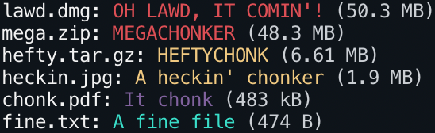

# `chonk`

Check the size of a file and determine its chonkiness

Inspired by <https://knowyourmeme.com/memes/chonk-oh-lawd-he-comin>

## Installation

```sh
# Local
npm i -D chonk

# Global
npm i -g chonk
```

## Usage

```sh
chonk [<options>] <file> <file>...
```

### Options

```sh-session
Options:
  --help       Show help                                               [boolean]
  --version    Show version number                                     [boolean]
  --lawd, -L   Minimum size in kilobytes for OH LAWD, OT COMIN'!
                                                     [number] [default: "50000"]
  --mega, -M   Minimum size in kilobytes for MEGACHONKER
                                                     [number] [default: "10000"]
  --hefty, -H  Minimum size in kilobytes for HEFTYCHONK
                                                      [number] [default: "2000"]
  --heck, -h   Minimum size in kilobytes for A heckin' chonker
                                                       [number] [default: "500"]
  --chonk, -c  Minimum size in kilobytes for It chonk   [number] [default: "50"]
```

### Sample

```sh-session
$ chonk lawd.dmg mega.zip hefty.tar.gz heckin.jpg chonk.pdf fine.txt
```


